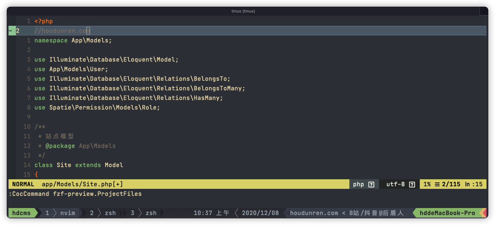

# 快速安装

这是 [向军大叔](https://www.houdunren.com) 使用的neovim配置，本章可以帮助你快速配置好用的nvovim环境



## 安装软件

### 环境依赖

下面是依赖的软件环境，请确定系统中已经安装成功

*  [npm](https://nodejs.org/zh-cn/) 
*  [yarn](https://classic.yarnpkg.com/en/docs/install/#mac-stable)
*  [python](https://www.python.org/downloads/)
*  [neovim](https://github.com/neovim/neovim/wiki/Installing-Neovim)
*  [vim-plug](https://github.com/junegunn/vim-plug)
*  [ranger](https://ranger.github.io/)

首先安装环境需要的软件

```
# mac
brew install node python3 yarn ranger

# manjaro
sudo pacman -Sy node python3 yarn ranger

# ubuntu
sudo apt install node python3 yarn ranger

# centos
sudo yum install node python3 yarn ranger
```

然后安装neovim需要软件包

```
python -m pip install pynvim

pip3 install --user --upgrade neovim

pip3 install ranger-fm
```

[vim-plug](https://github.com/junegunn/vim-plug)是一款非常轻量又高效的vim插件管理工具。它支持全异步、多线程并行安装插件，支持git分支、标签等，可以对插件进行回滚更新、还支持**按需加载**插件(On-demand loading)，可以指定对特定文件类型加载对应vim插件，大大加快了vim启动时间。


### vim-plug

可通过官网查看安装细节 https://github.com/junegunn/vim-plug，因为是国外服务器所以你要多试几次。为了帮助大家正常下载，下面的的链接地址已经放在后盾人CDN服务器上了。

```
curl -fLo ~/.local/share/nvim/site/autoload/plug.vim --create-dirs \
    https://houdunren-video.oss-cn-hangzhou.aliyuncs.com/soft/plug.vim
```


### 执行安装

下面列出的常用系统的安装方法，其他系统参考[官方文档](https://github.com/neovim/neovim/wiki/Installing-Neovim)进行安装

```
# MAC
brew install neovim

# manjaro
sudo pacman -Sy neovim

# ubuntu 
sudo apt install neovim 

# CENTOS 8
yum install neovim
```

注销并重新登录后执行`nvim`就可以打开软件了


## 软件配置

配置还是比较简单的，下载包后执行脚本，再次打开neovm时将自动安装插件

clone项目

```
git clone https://github.com/houdunwang/nvim.git ~/.config/nvim
```

执行脚本

如果脚本执行不成功，请手动将 `coc-settings` 更改为 `coc-settings.json`

```
sh ~/.config/nvim/init.sh
```

## COC插件

打开nvim执行以下命令安装coc扩展

```
CocInstall coc-css coc-explorer coc-html coc-snippets coc-ember coc-json coc-emmet coc-phpls coc-tsserver coc-eslint coc-highlight 

CocInstall coc-prettier coc-vetur coc-git coc-svg coc-phpls coc-eslint coc-tailwindcss coc-fzf-preview coc-tabnine coc-fzf-preview
```

## 安装后执行

安装 intelephense

```
npm i intelephense -g
```

进入 `~/.vim/plugged/bracey.vim` 执行以下命令，用于生成 liver-server 环境

```
cd ~/.vim/plugged/bracey.vim
npm install --prefix server
```


## 按键定义

Leader 键定义为了空格，下面是自定义的按键说明

### 移动定位

| 热键    | 说明             | 模式 |
| ------- | ---------------- | ---- |
| mm      | 添加注释         |      |
| shift+k | 上移5 行         |      |
| shift+j | 下移5行          |      |
| gd      | 转到类、函数定义 |      |
| gf      | 跳转到文件       |      |
| ctrl+j  | 行首             | 编辑 |
| ctrl_k  | 行尾             | 编辑 |

### 文件操作

| 热键     | 说明                 |
| -------- | -------------------- |
| rc       | 打开当前目录         |
| rp       | 打开项目目录         |
| leader+f | fzf项目文件模糊搜索  |
| leader+b | fzf  Buffer 文件搜索 |
| fp       | 项目文件检测         |
| fb       | 显示Buffers文件      |
| fg       | 显示文件GIT状态      |

### 其他操作

| 热键    | 说明                                       |
| ------- | ------------------------------------------ |
| :Bracey | 浏览器同步插件，类似vscode中的liver-server |

## 插件列表

下面是使用的部分插件，你也可以查看官方文档来自行配置插件

1. [https://github.com/neoclide/coc.nvim](https://github.com/neoclide/coc.nvim)
2. [https://github.com/mhinz/vim-startify](https://github.com/mhinz/vim-startify)
3. [https://github.com/Yggdroot/LeaderF](https://github.com/Yggdroot/LeaderF)
4. [https://github.com/ap/vim-css-color](https://github.com/ap/vim-css-color)
5. [https://github.com/vim-airline/vim-airline](https://github.com/vim-airline/vim-airline)
6. https://github.com/vim-airline/vim-airline-themes
7. [https://github.com/gcmt/wildfire.vim](https://github.com/gcmt/wildfire.vim)
8. [https://github.com/tpope/vim-surround](https://github.com/tpope/vim-surround)
9. [https://github.com/justinmk/vim-sneak](https://github.com/justinmk/vim-sneak)


